# Smart Contracts using Solidity with RemixIDE

To automate the creation of joint savings accounts, I created a solidity smart contract that accepts two user addresses that are then able to control a joint savings account. The smart contract will use ether management functions to implement various requirements from the financial institution to provide the features of the joint savings account.

1. Create and work within a local blockchain development environment using the JavaScript VM provided by the Remix IDE.

2. Script and deploy a **JointSavings** smart contract.

3. Interact with the deployed smart contract to transfer and withdraw funds.

---

## Technologies

This project leverages python 3.7.9 with the following packages:

* [Solidity](https://docs.soliditylang.org/en/v0.8.9/) - To help build a smart contract.

* [Remix IDE](https://remix.ethereum.org/) - Web based IDE for building Ethereum dApps using Solidity.

---

## Installation Guide

Before running the application first open up the Remix IDE and:

1. Import joint_svaings.sol into the IDE

2. Compile using Remix IDE

3. Deploy using Remix IDE

---

## Examples

Below is an example of how the application works by depositing and withdrawing while checking the balance and the last account to withdraw and the last withdraw balance.

1. Use `setAccounts`  to define the authorized Ethereum address that will be able to withdraw funds from your contract.

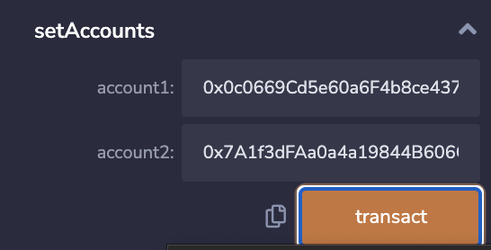
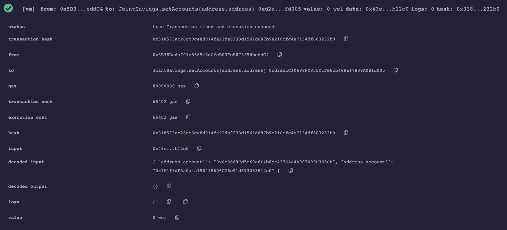

2. Transaction 1: Send 1 ether as wei.

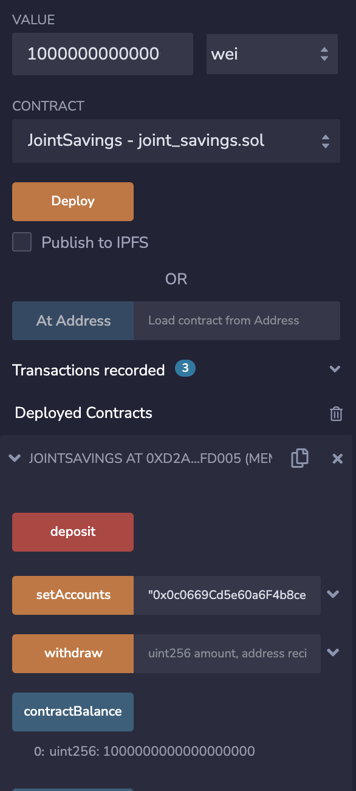
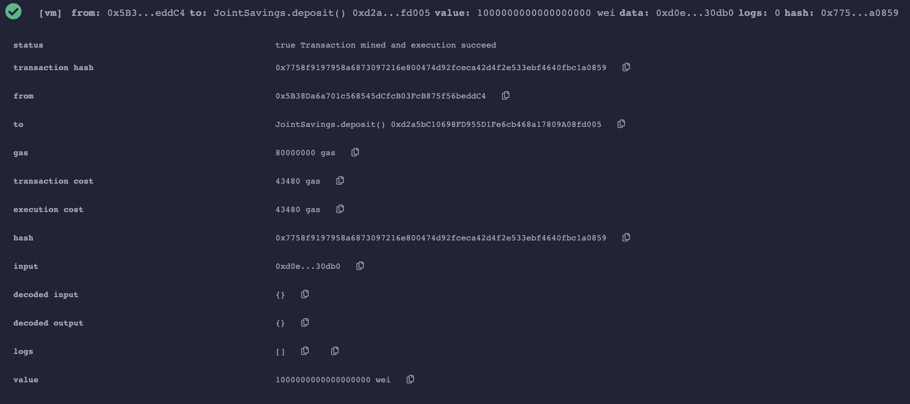
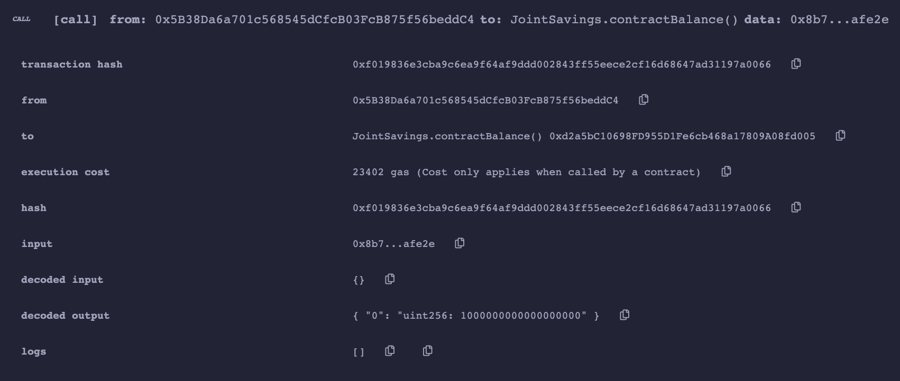

3. Transaction 2: Send 10 ether as wei.

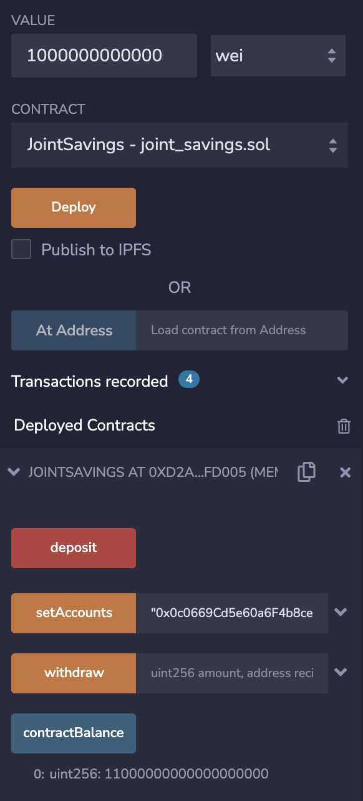
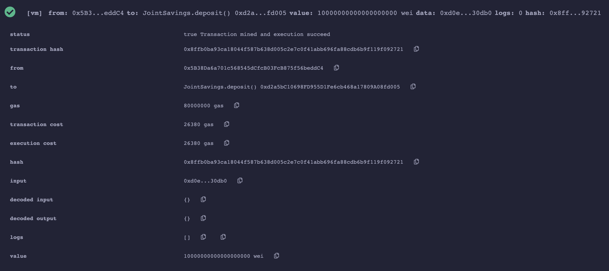
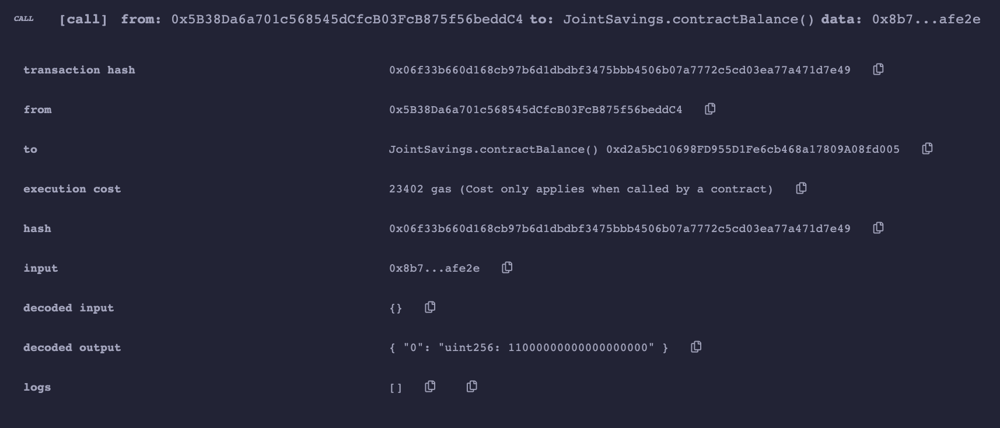

4. Transaction 3: Send 5 ether.

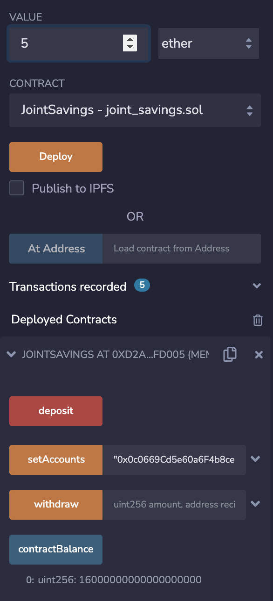
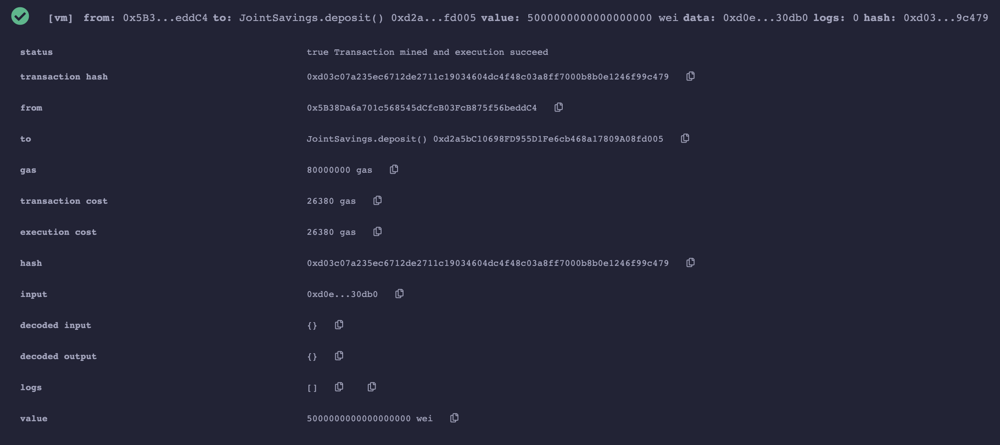
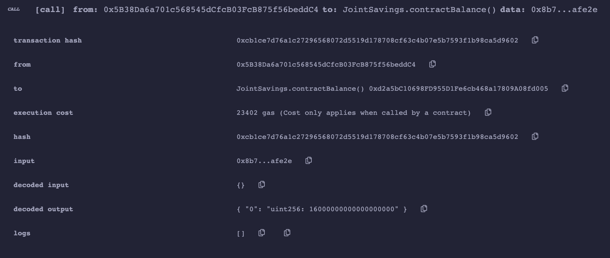

5. Withdraw 5 ether into `accountOne`.

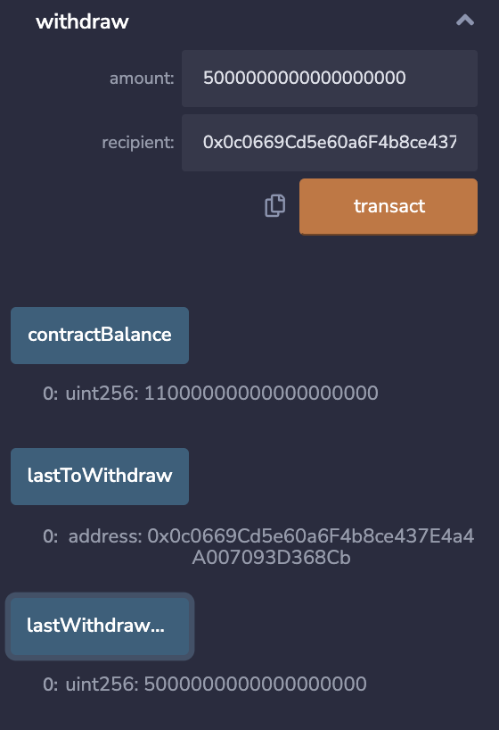
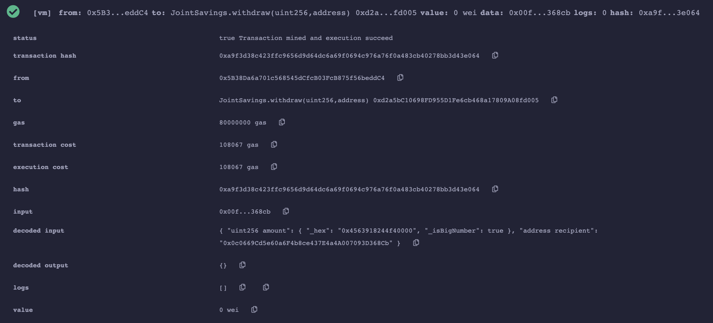
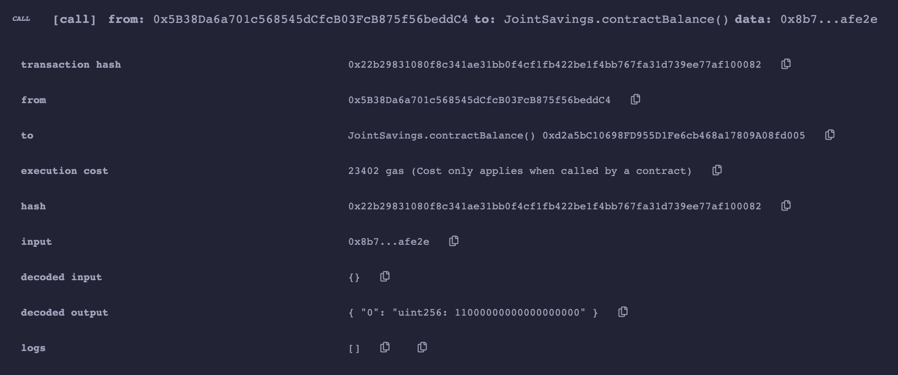
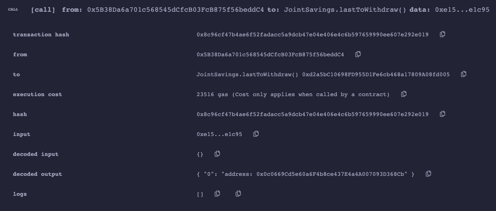
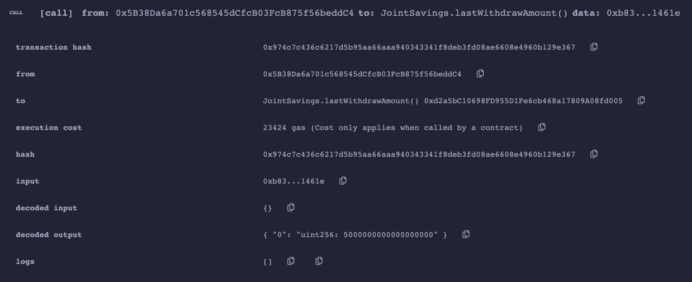

6. Withdraw 10 ether into `accountTwo`.

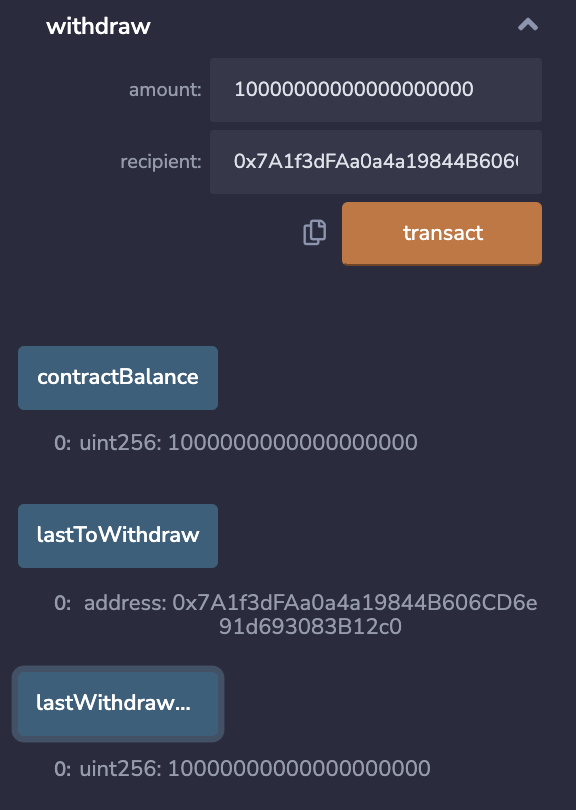
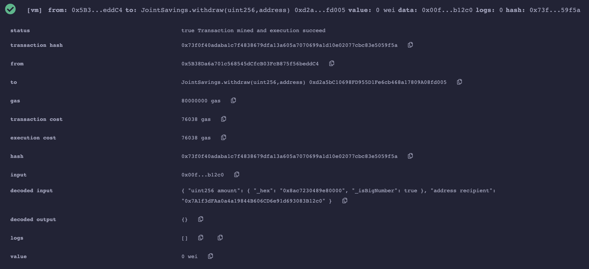
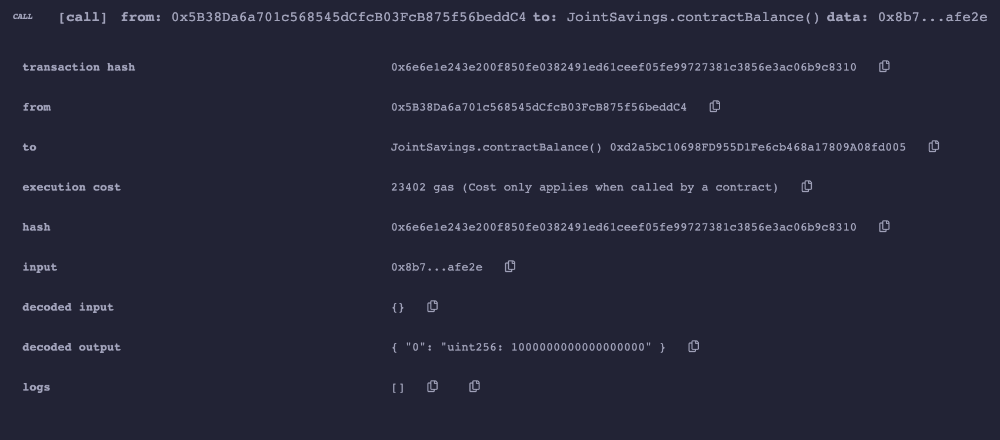
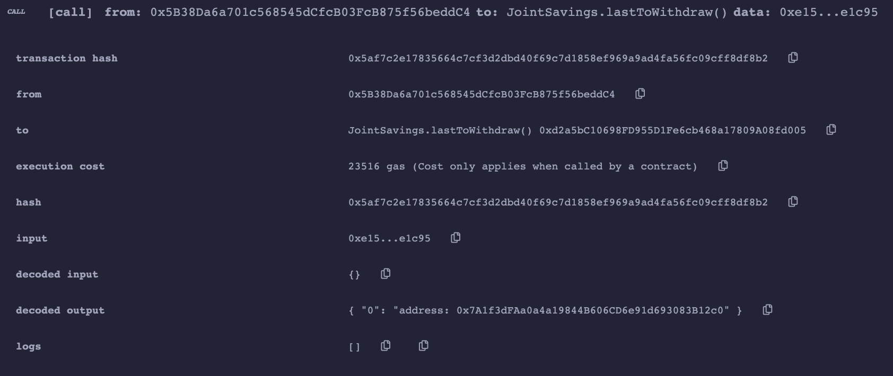
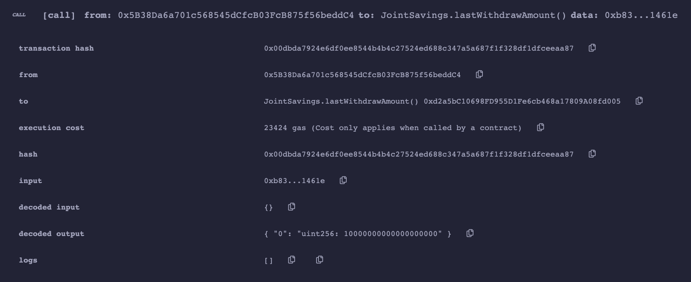

---

## Contributors 

Nathan Patterson

Email: nathan.e.patterson@gmail.com

[LinkedIn](https://www.linkedin.com/in/natepatterson/)
[Personal Site](https://www.n8patterson.com/)

---

## License

MIT License
Copyright (c) [2021] [Nathan Patterson]

Permission is hereby granted, free of charge, to any person obtaining a copy of this software and associated documentation files (the "Software"), to deal in the Software without restriction, including without limitation the rights to use, copy, modify, merge, publish, distribute, sublicense, and/or sell copies of the Software, and to permit persons to whom the Software is furnished to do so, subject to the following conditions:

The above copyright notice and this permission notice shall be included in all copies or substantial portions of the Software.

THE SOFTWARE IS PROVIDED "AS IS", WITHOUT WARRANTY OF ANY KIND, EXPRESS OR IMPLIED, INCLUDING BUT NOT LIMITED TO THE WARRANTIES OF MERCHANTABILITY, FITNESS FOR A PARTICULAR PURPOSE AND NONINFRINGEMENT. IN NO EVENT SHALL THE AUTHORS OR COPYRIGHT HOLDERS BE LIABLE FOR ANY CLAIM, DAMAGES OR OTHER LIABILITY, WHETHER IN AN ACTION OF CONTRACT, TORT OR OTHERWISE, ARISING FROM, OUT OF OR IN CONNECTION WITH THE SOFTWARE OR THE USE OR OTHER DEALINGS IN THE SOFTWARE.
